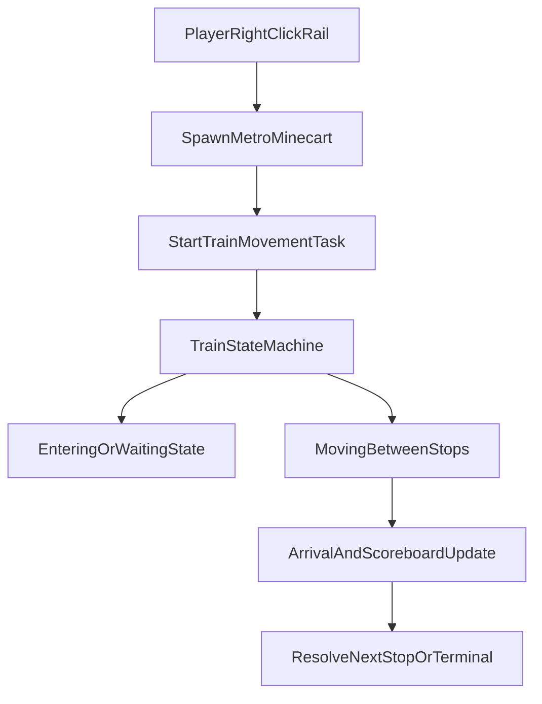

# Metro Architecture

## High-level Components

- `Metro` plugin bootstrap: lifecycle, manager wiring, command/listener registration.
- Managers:
  - `LineManager`: line persistence and stop-to-line index.
  - `StopManager`: stop persistence and world-based stop index.
  - `LanguageManager`: i18n message loading and fallback.
  - `SelectionManager`: player corner selections.
- Runtime:
  - `TrainMovementTask`: train state machine and ride lifecycle.
  - `ScoreboardManager`: ride-time visual status.
- Interaction:
  - Command entry: Cloud annotation commands in `command.newcmd`.
  - Main command groups: `MetroMainCommand`, `LineCommand`, `StopCommand`, `PortalCommand`.
  - Listeners: `PlayerInteractListener`, `PlayerMoveListener`, `VehicleListener`, `GuiListener`.

## Configuration Access

- `ConfigFacade` centralizes reads from `config.yml`.
- `Metro` exposes compatibility methods and delegates to `ConfigFacade`.
- New config keys should be added in `ConfigFacade` first.

## Persistence Model

- Lines are stored in `lines.yml`.
- Stops are stored in `stops.yml`.
- Managers load from YAML at startup and on `/m reload`.
- Invalid entries are handled defensively with warning logs where applicable.

## Runtime Flow

## Quality Gates

- Unit tests: Maven Surefire.
- Coverage gate: JaCoCo bundle line coverage threshold.
- Static analysis: SpotBugs check bound to `verify`.
